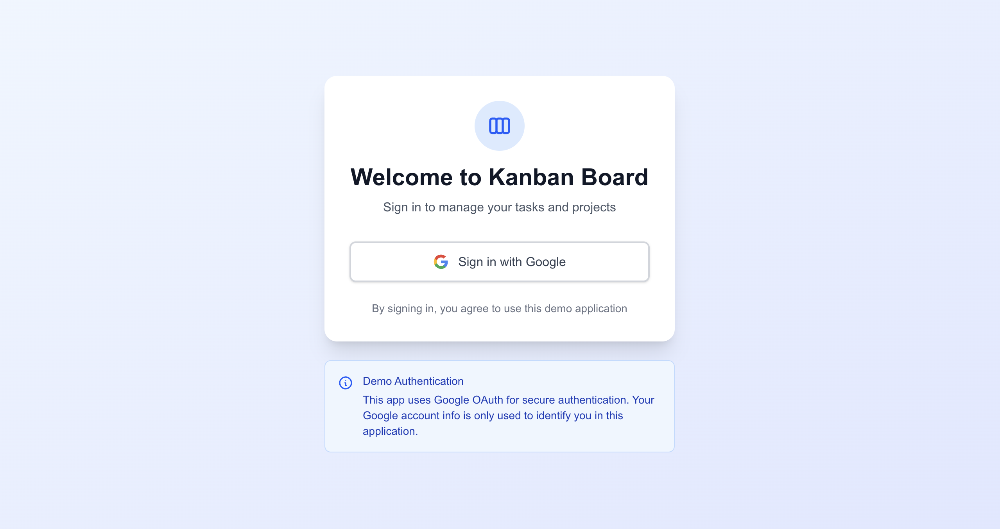
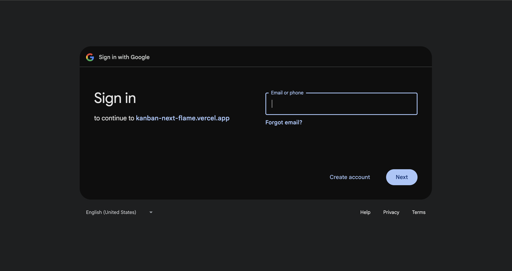
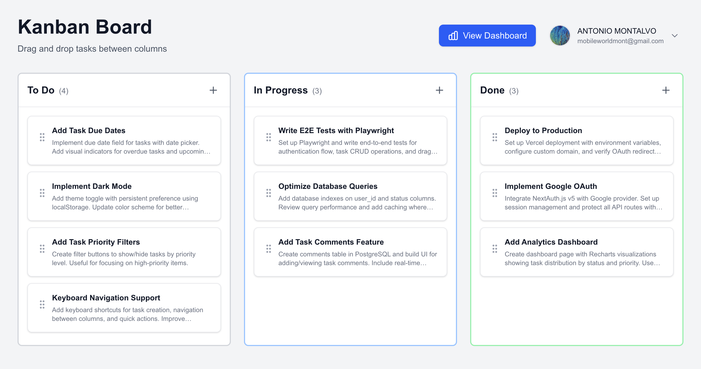
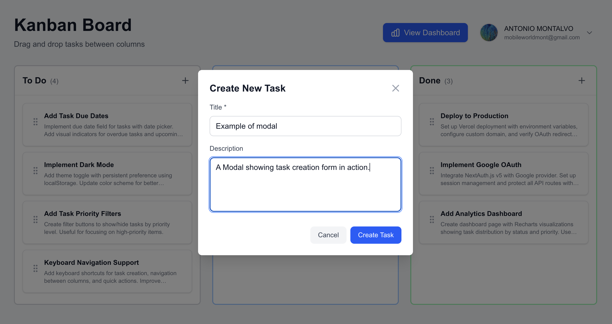
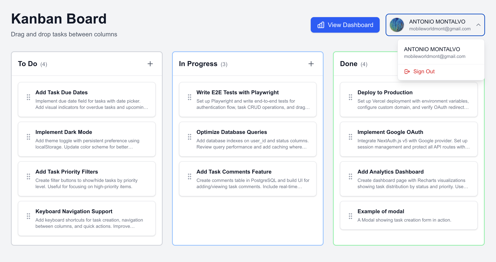
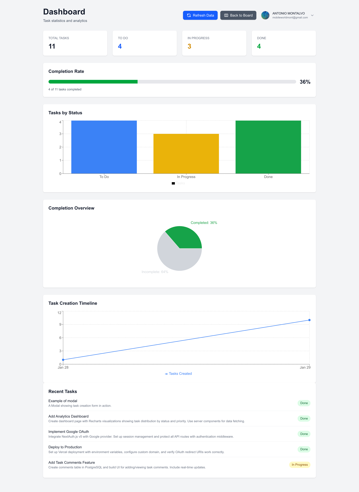

# Next.js Kanban Board 🎯

A full-stack Kanban board built to understand modern Next.js development. I started with a Vite/React version and migrated it to **Next.js 16** to learn server-side rendering, database integration, and user authentication.

What this project covers: building a complete backend with PostgreSQL, implementing Google OAuth, and designing a multi-user system with proper data isolation.

## 🚀 Live Demo

**[View Live Demo](https://kanban-next-flame.vercel.app/)** ← Sign in with Google to try it!

> **Note**: Each user has their own isolated task workspace. Your tasks are private and only visible to you.

### Screenshots

**Authentication Flow**


_Login page with Google OAuth integration_


_Google sign-in consent screen_

**Main Features**


_Main Kanban board with drag-and-drop functionality across To Do, In Progress, and Done columns_


_Task creation modal with title, description, status, and priority fields_


_User profile menu with authentication status and navigation options_

**Analytics Dashboard**


_Real-time analytics dashboard showing task distribution, completion rate, status timeline, and activity trends using Recharts_

## ✨ Features

### Core Functionality

- 📋 **Drag & Drop**: Smooth task movement between columns using @dnd-kit
- 🎨 **Modern UI**: Clean interface built with Tailwind CSS 4
- 🔄 **RESTful API**: Next.js API routes for full CRUD operations
- 📱 **Responsive Design**: Works seamlessly on desktop and mobile devices
- 🎯 **TypeScript**: Full type safety throughout the application

### Full-Stack Features

- 🔐 **OAuth Authentication**: Google sign-in powered by NextAuth.js v5
- 👥 **Multi-User Support**: User-specific task isolation and data privacy
- 🗄️ **PostgreSQL Database**: Serverless PostgreSQL via Vercel Postgres
- 📊 **Analytics Dashboard**: Server-rendered charts with Recharts
- 🎨 **Server Components**: Leveraging Next.js App Router for optimal performance

### Developer Experience

- ✅ **27 Passing Tests**: Comprehensive test suite with Vitest + React Testing Library
- 🚀 **Production-Ready**: Deployed on Vercel with environment-based configuration
- 📚 **Extensive Documentation**: Architecture decisions and learning references included

## 🛠️ Tech Stack

### Frontend

- **Framework**: Next.js 16.1.3 (App Router)
- **Language**: TypeScript 5
- **Styling**: Tailwind CSS 4
- **State Management**: Zustand 5
- **Drag & Drop**: @dnd-kit
- **Data Visualization**: Recharts 3.7

### Backend

- **Database**: PostgreSQL (Vercel Postgres / Neon serverless)
- **Authentication**: NextAuth.js v5 (beta)
- **API**: Next.js Route Handlers
- **ORM**: Direct SQL with `@vercel/postgres`

### DevOps & Testing

- **Testing**: Vitest + React Testing Library + jsdom
- **Deployment**: Vercel (serverless functions + edge runtime)
- **CI/CD**: Git-based deployment with automatic previews

---

## 🏗️ Architecture & Design Decisions

This section explains **why** certain technologies and patterns were chosen, serving as both documentation and interview preparation material.

### PostgreSQL Over MongoDB

For this kind of project—a Kanban board where data has defined structure and relationships—PostgreSQL excels. In kanban-next, tasks belong to users, and PostgreSQL enforces this via foreign keys. Using MongoDB would have made managing these relationships more complicated, requiring manual checks and validation.

PostgreSQL is also ACID-compliant by default (atomicity, consistency, isolation, durability). If a user moves a task, I can guarantee that the new state is saved correctly and immediately visible. No eventual consistency concerns.

For querying, filtering tasks is optimized in SQL. Being the universal language of data, complex reporting, analytics, and joining data across multiple tables (e.g., joining Users, Tasks, and future Comments) is generally more performant and easier to write in SQL than using MongoDB's aggregation framework.

As for serverless compatibility: modern Postgres providers like Neon, Vercel Postgres solve the connection issues that traditional PostgreSQL databases face with serverless functions like Next.js API routes.

This contrasts with my e-commerce project where MongoDB's flexibility with product variants and dynamic attributes was a better fit.

**Schema Design**:

```sql
-- Users table (managed by NextAuth.js)
CREATE TABLE users (
  id SERIAL PRIMARY KEY,
  email VARCHAR(255) UNIQUE NOT NULL,
  name VARCHAR(255),
  image TEXT,
  created_at TIMESTAMP DEFAULT CURRENT_TIMESTAMP
);

-- Tasks table with user relationship
CREATE TABLE tasks (
  id SERIAL PRIMARY KEY,
  title VARCHAR(255) NOT NULL,
  description TEXT,
  status VARCHAR(50) NOT NULL,  -- 'To Do', 'In Progress', 'Done'
  priority VARCHAR(50) NOT NULL, -- 'Low', 'Medium', 'High'
  user_id INTEGER REFERENCES users(id) ON DELETE CASCADE,
  created_at TIMESTAMP DEFAULT CURRENT_TIMESTAMP,
  updated_at TIMESTAMP DEFAULT CURRENT_TIMESTAMP
);
```

**What I learned building this**:

- How to write secure database queries that protect user data
- Setting up the schema so tasks automatically get cleaned up if a user deletes their account
- That `column` is a reserved SQL keyword (learned this the hard way!) — switched to using `status` instead

---

### Google OAuth via NextAuth.js

For authentication, I chose Google OAuth over traditional username/password for several practical reasons.

First, user experience: one click to sign in, no password to remember or reset. Second, security: Google manages authentication infrastructure, password storage and account recovery or removing. It takes that responsibility from my application entirely.

OAuth is also the modern standard for consumer applications. Users expect "Sign in with Google" and trust it more than creating another account.

From a development perspective, NextAuth.js handles the entire OAuth flow, session management, and security concerns automatically. I provide the Google OAuth credentials, and NextAuth manages everything else.

This contrasts with my e-commerce project where I implemented JWT-based authentication with password hashing—learning.

**How it works**:

```
1. User clicks "Sign in with Google"
2. Google handles authentication and returns user info (email, name, photo)
3. I check if this user exists in my database:
   - Existing user → retrieve their ID
   - New user → create a database record for them
4. User's ID gets attached to their session
5. Every API request uses this session to show them only THEIR tasks
```

**Implementation Files**:

- `auth.config.ts`: NextAuth configuration with Google provider
- `auth.ts`: Exports auth helpers (`signIn`, `signOut`, `auth`)
- `app/api/auth/[...nextauth]/route.ts`: NextAuth API route handler
- `app/login/page.tsx`: Login UI with Google button
- `middleware.ts`: Route protection (redirects unauthenticated users)

**What I learned**:

- NextAuth changed how you get session data — now you use `auth()` instead of older methods
- How to extend TypeScript types to include custom session data.
- Setting up OAuth requires three environment variables: a secret key, Google client ID, and Google client secret

---

### Server vs Client Components

**Server Components** run on the server and send HTML to the browser.

- The main board page (checks authentication before rendering)
- The analytics dashboard (fetches stats directly from the database without an API layer)

Benefit: smaller JavaScript bundle, faster initial page load, direct database access.

**Client Components** run in the browser and require the `'use client'` directive. I use them for:

- The drag-and-drop board (needs React hooks for interaction state)
- Task creation/edit modals (manage form input)
- User menu dropdown (responds to clicks)

The rule: anything interactive needs to be a client component. But keep the interactive parts isolated—fetch data on the server, then pass it to client components for interactivity only.

**Key lesson I learned**:

```tsx
// ❌ Don't do this - makes everything run in the browser
'use client'
export default function DashboardPage() { ... }

// ✅ Better - fetch data on server, only make interactive parts client components
export default function DashboardPage() {
  const stats = await fetchStatsFromDB(); // Runs on server
  return <ClientChart data={stats} />; // Only this part runs in browser
}
```

---

### Multi-User Data Isolation

With multiple users sharing the application, data privacy is critical. Users shouldn't see each other's tasks.

The solution: enforce privacy at the database level, never trust the browser. Every database query filters by `user_id` from the server session. The browser claims nothing. The server verifies authentication and filters data accordingly.

**API Route Protection Pattern**:

```typescript
// app/api/tasks/route.ts
export async function GET(request: Request) {
  // 1. Verify authentication
  const session = await auth();
  if (!session?.user?.id) {
    return NextResponse.json({ error: "Unauthorized" }, { status: 401 });
  }

  // 2. Filter by user_id (CRITICAL for data isolation)
  const result = await sql`
    SELECT * FROM tasks 
    WHERE user_id = ${session.user.id}
    ORDER BY created_at DESC
  `;

  return NextResponse.json(result.rows);
}
```

**Security approach**:

- Get user ID from the server session, not from what the browser claims
- Every database query filters by `WHERE user_id = [session.user.id]`
- If someone tries to access the API without logging in, they get a 401 error
- Error messages don't reveal database details

**Testing Multi-User Isolation**:

1. Sign in as User A → Create tasks
2. Sign out → Sign in as User B
3. Verify User B cannot see User A's tasks ✅

---

### Serverless PostgreSQL

I chose Vercel Postgres (powered by Neon) because it's optimized for serverless environments.

Next.js API routes start and stop on-demand. They're serverless functions. Neon handles connections. Additionally, it integrates seamlessly with Vercel deployment. No separate database server to configure.

**Connection Pattern**:

```typescript
import { sql } from "@vercel/postgres";

// Direct SQL execution (no connection management needed)
const result = await sql`SELECT * FROM tasks WHERE user_id = ${userId}`;
```

---

## 📦 Getting Started

### Prerequisites

- Node.js 18+ (LTS recommended)
- npm or yarn
- Google Cloud Console account (for OAuth credentials)
- Vercel account (for database and deployment)

### Environment Variables

Create a `.env.local` file in the project root:

```bash
# Database (Vercel Postgres)
POSTGRES_URL="postgres://..."              # From Vercel dashboard
POSTGRES_PRISMA_URL="postgres://..."       # From Vercel dashboard
POSTGRES_URL_NON_POOLING="postgres://..."  # From Vercel dashboard
POSTGRES_USER="..."                        # From Vercel dashboard
POSTGRES_HOST="..."                        # From Vercel dashboard
POSTGRES_PASSWORD="..."                    # From Vercel dashboard
POSTGRES_DATABASE="..."                    # From Vercel dashboard

# Authentication (NextAuth.js)
AUTH_SECRET="your-secret-here"             # Generate: openssl rand -base64 32
AUTH_GOOGLE_ID="your-google-client-id"     # From Google Cloud Console
AUTH_GOOGLE_SECRET="your-google-secret"    # From Google Cloud Console
```

**How to Get These Values**:

1. **Database Credentials** (Vercel Postgres):

   ```bash
   # Option 1: Pull from existing Vercel project
   vercel env pull .env.local

   # Option 2: Create new database
   # 1. Go to vercel.com → Your Project → Storage tab
   # 2. Click "Create Database" → Select "Postgres"
   # 3. Copy connection strings to .env.local
   ```

2. **Google OAuth Credentials** (Google Cloud Console):

   ```
   1. Go to console.cloud.google.com
   2. Create new project (or select existing)
   3. Navigate to "APIs & Services" → "Credentials"
   4. Click "Create Credentials" → "OAuth 2.0 Client ID"
   5. Application type: "Web application"
   6. Authorized redirect URIs:
      - http://localhost:3000/api/auth/callback/google (development)
      - https://your-domain.vercel.app/api/auth/callback/google (production)
   7. Copy Client ID and Client Secret to .env.local
   ```

3. **Generate AUTH_SECRET**:
   ```bash
   openssl rand -base64 32
   # Copy output to AUTH_SECRET in .env.local
   ```

### Database Setup

Initialize the database schema:

```bash
# Option 1: Use Vercel CLI (recommended)
vercel env pull .env.local  # Pull environment variables
npm run setup-db            # Run database setup script

# Option 2: Manual SQL execution
# 1. Go to Vercel dashboard → Your project → Storage → Postgres
# 2. Click "Query" tab
# 3. Execute SQL from schema.sql file
```

**Schema Files**:

- Database schema is automatically created via `/api/setup-db` route
- Tables created: `users`, `tasks`
- Seed data: None (users created on first sign-in)

### Installation & Running

```bash
# Clone the repository
git clone https://github.com/AntonioMontalvo/kanban-next.git
cd kanban-next

# Install dependencies
npm install

# Set up environment variables (see above)
cp .env.example .env.local
# Edit .env.local with your credentials

# Initialize database
npm run setup-db
# or visit: http://localhost:3000/api/setup-db

# Run development server
npm run dev
```

Open [http://localhost:3000](http://localhost:3000) to see the app.

**First-Time Setup Checklist**:

- [ ] Environment variables configured
- [ ] Database tables created (visit `/api/setup-db`)
- [ ] Google OAuth configured with correct redirect URIs
- [ ] Development server running on port 3000
- [ ] Can sign in with Google account

## 🧪 Testing

```bash
# Run all tests
npm test

# Run tests in watch mode
npm run test:watch

# Run tests with coverage
npm run test:coverage
```

**Test Coverage**: 27 passing tests

- TaskCard component: 6 tests
- TaskModal component: 9 tests
- Column component: 6 tests
- Board component: 3 tests
- Integration tests: 3 tests

**Testing Strategy**:

- **Component Tests**: User interactions, rendering, props validation
- **Integration Tests**: Drag-and-drop workflows, modal interactions
- **Edge Cases**: Empty states, invalid inputs, error handling

**Note**: API routes and authentication flows are tested manually (E2E tests planned for future)

---

## 📝 API Routes

All API routes require authentication. Requests without valid session return `401 Unauthorized`.

### Tasks API

#### `GET /api/tasks`

Fetch all tasks for authenticated user.

**Response**:

```json
{
  "tasks": [
    {
      "id": "1",
      "title": "Task title",
      "description": "Task description",
      "column": "To Do",
      "createdAt": 1706097600000
    }
  ]
}
```

#### `POST /api/tasks`

Create a new task.

**Request Body**:

```json
{
  "title": "New task",
  "description": "Task details",
  "column": "To Do"
}
```

**Response**: `201 Created`

```json
{
  "task": {
    "id": "2",
    "title": "New task",
    "description": "Task details",
    "column": "To Do",
    "createdAt": 1706097600000
  }
}
```

#### `GET /api/tasks/[id]`

Get a specific task (only if owned by authenticated user).

**Response**: `200 OK`

```json
{
  "task": {
    "id": "1",
    "title": "Task title",
    "description": "Task description",
    "column": "To Do",
    "createdAt": 1706097600000
  }
}
```

**Error**: `404 Not Found` if task doesn't exist or belongs to another user

#### `PUT /api/tasks/[id]`

Update a task (only if owned by authenticated user).

**Request Body**: Partial task object (any fields to update)

```json
{
  "title": "Updated title",
  "column": "In Progress"
}
```

**Response**: `200 OK`

```json
{
  "task": {
    "id": "1",
    "title": "Updated title",
    "description": "Task description",
    "column": "In Progress",
    "createdAt": 1706097600000
  }
}
```

**Error**: `404 Not Found` if task doesn't exist or belongs to another user

#### `DELETE /api/tasks/[id]`

Delete a task (only if owned by authenticated user).

**Response**: `200 OK`

```json
{
  "message": "Task deleted successfully"
}
```

**Error**: `404 Not Found` if task doesn't exist or belongs to another user

---

### Authentication API

#### `GET /api/auth/session`

Get current session (provided by NextAuth.js).

**Response**:

```json
{
  "user": {
    "id": 123,
    "email": "user@example.com",
    "name": "User Name",
    "image": "https://..."
  },
  "expires": "2026-02-20T10:00:00Z"
}
```

#### `POST /api/auth/signin/google`

Initiate Google OAuth flow (handled by NextAuth.js).

#### `POST /api/auth/signout`

Sign out user (handled by NextAuth.js).

---

### Utility Routes

#### `GET /api/setup-db`

Initialize database tables (development only).

**Response**: `200 OK` with creation status

#### `GET /api/test-db`

Test database connection (development only).

**Response**: Current timestamp from database

## 🚀 Deployment

### Deploying to Vercel

This project is optimized for Vercel deployment with zero configuration.

**Steps**:

1. **Push to GitHub**:

   ```bash
   git add .
   git commit -m "Ready for deployment"
   git push origin main
   ```

2. **Import to Vercel**:
   - Go to [vercel.com](https://vercel.com)
   - Click "New Project" → Import your Git repository
   - Vercel auto-detects Next.js configuration

3. **Set Environment Variables**:
   - In Vercel dashboard → Your Project → Settings → Environment Variables
   - Add all variables from `.env.local`:
     - `AUTH_SECRET`
     - `AUTH_GOOGLE_ID`
     - `AUTH_GOOGLE_SECRET`
     - Database variables (auto-set if using Vercel Postgres)

4. **Create Database** (if not done):
   - Storage tab → Create Database → Postgres
   - Run setup: Visit `https://your-app.vercel.app/api/setup-db`

5. **Update Google OAuth**:
   - Google Cloud Console → Your OAuth app
   - Add production URL to Authorized redirect URIs:
     - `https://your-app.vercel.app/api/auth/callback/google`

6. **Deploy**:
   - Vercel automatically deploys on every git push to `main`
   - Preview deployments created for pull requests

**Production Checklist**:

- [ ] All environment variables set in Vercel
- [ ] Database tables created (visit `/api/setup-db`)
- [ ] Google OAuth redirect URI includes production URL
- [ ] Custom domain configured (optional)
- [ ] Preview deployments working for PRs

**Live Production**: [https://kanban-next-flame.vercel.app/](https://kanban-next-flame.vercel.app/)

---

## 📁 Project Structure

```
kanban-next/
├── app/                          # Next.js App Router
│   ├── api/                      # API Routes
│   │   ├── auth/[...nextauth]/   # NextAuth.js handler
│   │   ├── setup-db/             # Database initialization
│   │   ├── test-db/              # Connection test
│   │   └── tasks/                # Task CRUD operations
│   │       ├── route.ts          # GET (all tasks), POST (create)
│   │       └── [id]/route.ts     # GET, PUT, DELETE (single task)
│   ├── dashboard/                # Analytics dashboard
│   │   ├── page.tsx              # Server component with Recharts
│   │   └── loading.tsx           # Loading skeleton
│   ├── login/                    # Authentication
│   │   └── page.tsx              # Google OAuth login page
│   ├── layout.tsx                # Root layout (Geist fonts)
│   ├── page.tsx                  # Main board page (server component)
│   └── globals.css               # Global styles + Tailwind
│
├── components/                   # React Components
│   ├── Board.tsx                 # Main Kanban board (client)
│   ├── Column.tsx                # Task column with drag-drop
│   ├── TaskCard.tsx              # Individual task card
│   ├── TaskModal.tsx             # Create/edit task modal
│   ├── UserMenu.tsx              # User avatar dropdown (client)
│   ├── DashboardCharts.tsx       # Recharts visualizations
│   └── RefreshButton.tsx         # Client refresh component
│
├── stores/                       # State Management
│   └── boardStore.ts             # Zustand store (tasks, columns)
│
├── types/                        # TypeScript Definitions
│   └── index.ts                  # Task, Column, User types
│
├── utils/                        # Utility Functions
│   └── storage.ts                # LocalStorage helpers (unused in prod)
│
├── __tests__/                    # Vitest Tests
│   ├── setup.ts                  # Test configuration
│   ├── Board.test.tsx            # Board component tests
│   ├── Column.test.tsx           # Column component tests
│   ├── TaskCard.test.tsx         # TaskCard component tests
│   └── TaskModal.test.tsx        # TaskModal component tests
│
├── auth.config.ts                # NextAuth configuration
├── auth.ts                       # NextAuth exports (auth, signIn, signOut)
├── middleware.ts                 # Route protection
├── vitest.config.ts              # Vitest configuration
├── next.config.ts                # Next.js configuration
├── tailwind.config.js            # Tailwind CSS configuration
└── tsconfig.json                 # TypeScript configuration
```

**Key Files Explained**:

- **`auth.config.ts`**: Defines Google OAuth provider, callbacks for user management
- **`app/api/tasks/route.ts`**: Handles GET (fetch all) and POST (create) for tasks
- **`app/api/tasks/[id]/route.ts`**: Handles GET, PUT, DELETE for individual tasks
- **`components/Board.tsx`**: Client component managing drag-and-drop state
- **`stores/boardStore.ts`**: Zustand store for client-side task management
- **`app/page.tsx`**: Server component that checks auth and renders board

---

## 📚 Documentation

### Project-Specific Guides

- **[MIGRATION_NOTES.md](MIGRATION_NOTES.md)** - Detailed notes on Vite → Next.js migration process
- **[NEXTJS_ENHANCEMENT_GUIDE.md](NEXTJS_ENHANCEMENT_GUIDE.md)** - Day-by-day enhancement roadmap (Days 1-5)

### Learning References (in main PortfolioSite repo)

- **[SQL_FUNDAMENTALS.md](../PortfolioSite/SQL_FUNDAMENTALS.md)** - PostgreSQL basics, queries, and patterns
- **[REACT_TESTING_REFERENCE.md](../PortfolioSite/REACT_TESTING_REFERENCE.md)** - Testing patterns and examples
- **[RECHARTS_REFERENCE.md](../PortfolioSite/Learning_Notes/RECHARTS_REFERENCE.md)** - Recharts usage guide
- **[PROGRESS_LOG.md](../PortfolioSite/PROGRESS_LOG.md)** - Daily development log (Days 1-6)

---

## 🎓 What I Learned

Building this project taught me how modern full-stack development works when everything integrates together—database, authentication, deployment, and testing.

**Frontend Skills**: Next.js 16's App Router required understanding when to use server components (for direct database access) versus client components (for interactivity). TypeScript helped catch bugs early, and learning @dnd-kit's drag-and-drop API was more complex than expected. Recharts turned out to be straightforward once I understood the data structure it needs.

**Backend Skills**: Writing SQL queries felt more precise than MongoDB aggregations—filtering by user_id to enforce data privacy was straightforward. NextAuth v5 handled OAuth complexity automatically, but I had to learn how sessions work in serverless environments. The biggest lesson: never trust what the browser sends; always verify authentication on the server.

**DevOps**: Deploying on Vercel was seamless except for understanding how serverless functions handle database connections differently than traditional servers. Neon's connection pooling solved the "too many connections" problem I initially encountered. Environment variables management across development and production environments required careful attention.

**Architecture Choices**: This project forced me to make real decisions—PostgreSQL over MongoDB (structured data won), OAuth over passwords (better UX and security), server components where possible (smaller JavaScript bundles). Each choice taught me the tradeoffs rather than just following tutorials.

The testing suite (27 tests covering components and interactions) helped me catch regressions early, though I still need to add E2E tests for complete coverage.

---

## 🔄 Comparison: Kanban (Next.js) vs E-commerce (MERN)

This project intentionally uses a **different tech stack** than my MERN e-commerce app to demonstrate versatility:

| Feature        | Kanban (Next.js)       | E-commerce (MERN)          |
| -------------- | ---------------------- | -------------------------- |
| **Framework**  | Next.js (full-stack)   | React + Express (separate) |
| **Database**   | PostgreSQL (SQL)       | MongoDB (NoSQL)            |
| **Auth**       | NextAuth + OAuth       | JWT + bcrypt               |
| **API**        | Next.js Route Handlers | Express REST API           |
| **Rendering**  | SSR + Client           | Client-side only (SPA)     |
| **Deployment** | Vercel (serverless)    | Railway (containerized)    |
| **State**      | Zustand                | Context API                |

**Why Both?**

- Demonstrates knowledge of **multiple paradigms** (SQL & NoSQL, OAuth & JWT, SSR & SPA)
- Shows ability to **choose appropriate tools** for project requirements
- Proves **adaptability** to different tech stacks and architectures

---

## 🚧 Future Enhancements

Planned improvements (not blocking portfolio readiness):

- [ ] **E2E Tests**: Playwright tests for critical user flows
- [ ] **Real-time Updates**: WebSocket integration for collaborative editing
- [ ] **Task Attachments**: File upload with cloud storage (AWS S3/Cloudinary)
- [ ] **Search & Filters**: Advanced task filtering by date, priority, status
- [ ] **Notifications**: Email reminders for due dates
- [ ] **Dark Mode**: Theme toggle with persistent preference
- [ ] **Accessibility**: ARIA labels, keyboard navigation improvements
- [ ] **Performance**: Image optimization, code splitting, caching strategies

---

## 👤 Author

**Antonio Montalvo**

- GitHub: [@AntonioMontalvo](https://github.com/AntonioMontalvo)
- Portfolio: [antonio-portfolio-master-bt2g.vercel.app](https://antonio-portfolio-master-bt2g.vercel.app/)

## 📄 License

This project is open source and available under the MIT License.
